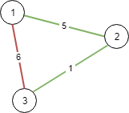

# 1135. 最低成本联通所有城市

想象一下你是个城市基建规划者，地图上有 N 座城市，它们按以 1 到 N 的次序编号。

给你一些可连接的选项 conections，其中每个选项 conections[i] = [city1, city2, cost] 表示将城市 city1 和城市 city2 连接所要的成本。（连接是双向的，也就是说城市 city1 和城市 city2 相连也同样意味着城市 city2 和城市 city1 相连）。

返回使得每对城市间都存在将它们连接在一起的连通路径（可能长度为 1 的）最小成本。
该最小成本应该是所用全部连接代价的综合。如果根据已知条件无法完成该项任务，则请你返回 -1。



```
输入：N = 3, conections = [[1,2,5],[1,3,6],[2,3,1]]
输出：6
解释：
选出任意 2 条边都可以连接所有城市，我们从中选取成本最小的 2 条。

```


```
输入：N = 4, conections = [[1,2,3],[3,4,4]]
输出：-1
解释： 
即使连通所有的边，也无法连接所有城市。
 
提示：
1 <= N <= 10000
1 <= conections.length <= 10000
1 <= conections[i][0], conections[i][1] <= N
0 <= conections[i][2] <= 10^5
conections[i][0] != conections[i][1]

```
